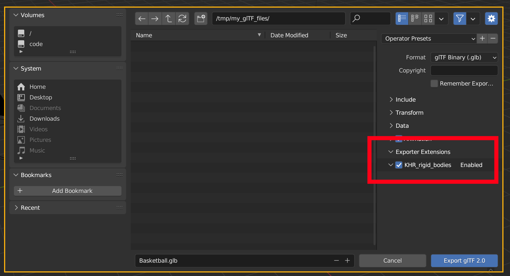
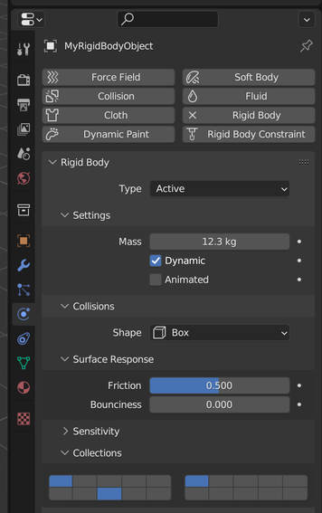
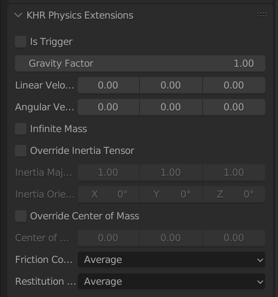
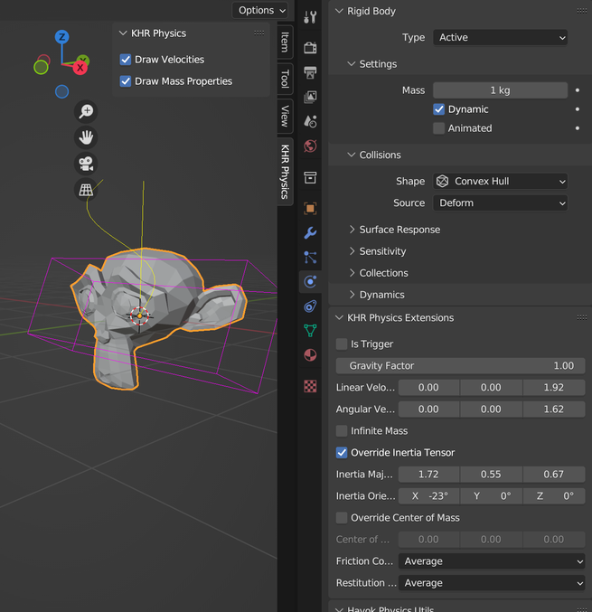

## Extension to export rigid body information in a glTF file.

This is a work in progressused to validate the concepts used by the proposed
glTF specification for rigid body dynamics, [KHR_rigid_bodies](https://github.com/eoineoineoin/glTF_Physics) - while this addon may undergo change in future iterations, it has been deployed for production use.

## Installation

1. Download a zip file from the [releases](https://github.com/eoineoineoin/glTF_Physics_Blender_Exporter/releases) page.
2. Launch Blender.
3. Navigate to Edit → Preferences → Add-ons and click the "Install" button.
4. Select the zip file you downloaded.
5. Browse to and enable the addon "Import-Export: KHR\_rigid\_bodies"

Once installed and enabled, the exporter extension is ready to use. When exporting a glTF file (using the "File" → "Export" → "glTF 2.0" menu in Blender) the plugin can be enabled by enabling it in the "Exporter Extensions" setting of the file selection:



Enabling this option will add rigid body information to the exported file.

## Alternate installation (for development)

1. Clone this repository.
2. Launch Blender.
3. Navigate to Edit → Preferences → File Paths.
4. In the "Script Directories" section, add a new entry, with the location of the cloned repository (i.e. the directory which contains this README.md)
5. Restart Blender.
6. Navigate to Edit → Preferences → Add-ons.
7. Browse to and enable the addon "Import-Export: KHR\_rigid\_bodies"


## Usage

This extension works with Blender's existing rigid body physics UI. For a mesh object, you can open the Physics properties panel and add "Rigid Body" or "Rigid Body Constraint" settings as you normally would:



When exporting, this will result in a glTF node with additional extension data:

```
{
    "name":"MyRigidBodyObject"
    "mesh":0,
    "extensions":{
        "KHR_rigid_bodies":{
            "motion":{
                "mass":12.3
            },
            "collider":{
                "collider":0,
                "physicsMaterial":0,
                "collisionFilter":0
            }
        }
    },
}
```

Almost all of Blender's rigid body properties are supported by the glTF extension; however, be aware that the settings inside Blender's "Sensitivity" and "Dynamics" sections are not exported, as these are specific to the simulation engine used by Blender.

## Additional functionality

This addon adds some additional settings for rigid bodies. These are not \[currently\] reflected when simulating inside Blender; however, they do allow for additional configuration of bodies on export. These reflect additional options which are described in the glTF extension specification. This appears as an additional panel, beneath Blender's rigid body properties:



When appropriate, visualisation of these properties can optionally be added to the 3D viewport. When the extension is loaded, a new tab is present in the viewport options:



Here, we can see the inital linear/angular velocities of the body (represented here by the straight/curved yellow lines, respectively) as well as the mass properties in purple. The cross is drawn at the center of mass, while the purple box (drawn at the center of mass) represents the inertia tensor.

## Known limitations

Collision geometry may not have the minimal required volume for that particular shape type if vertices are offset from node; this matches Blender's behaviour.

Blender's UI hides collision filtering information for children of a "Compound Parent" body - to set the collision filtering information for such an object, the child needs to be temporarily unparented from the compound.

